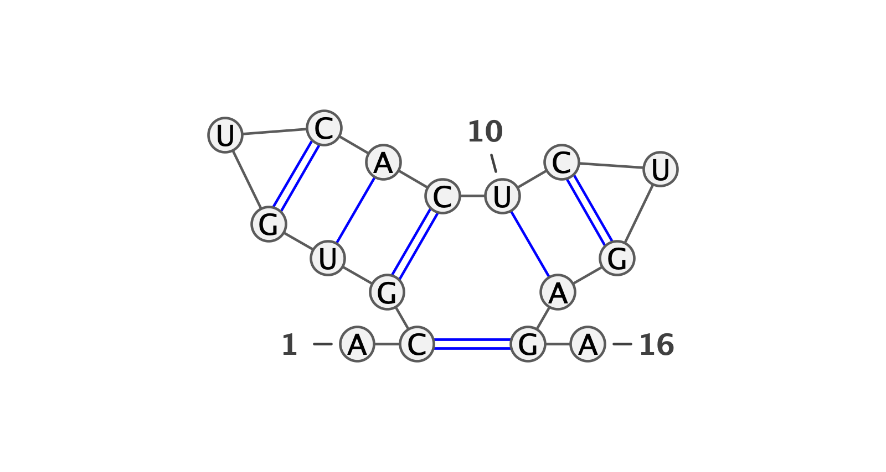
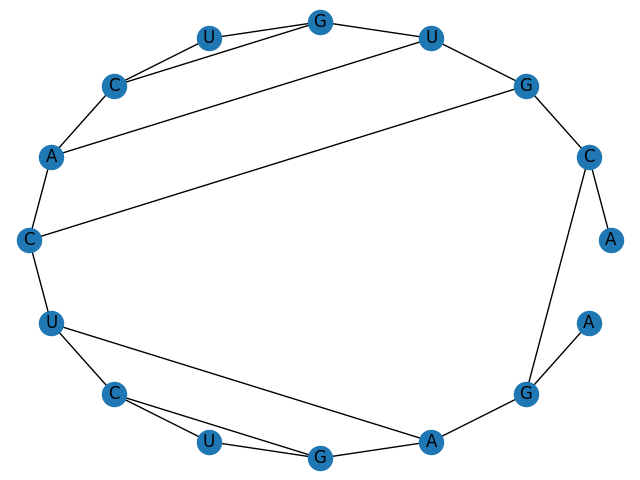

# CS571_final_project
This repository is for CS571 final project in Purdue University.


## Nussinov's Algorithm
In the directory of nussinov, it is a project of Nussinov's Algorithm.
If you want to access this project, go to the directory of `nussinov`

```
cd nussinov
```

## Installation
You can install all the dependencies by

```
pip install -r requirements.txt
```

## Execution

If you want to run nussinov's Algorithm you can go to the nussinov directory and simply run:

```
python main.py
```

with the following options:

```
optional arguments:
  -h, --help                        show this help message and exit
  --seq                             RNA sequence
  --seq_file                        File for RNA Sequence
  --output                          The output path of images of predicted secondary struction
  --min_loop_length                 Min loop length
  --score_metrics_file              File of Score metrics
  --circular_plot_file              The output path of circular plot

```

For example, If you execute,

```
python main.py --seq CGAGUCGGAGUC --output demo/demo1.png --min_loop_length 0
```

Note: If you don't specify the scoring metrics, we will use {(A, C): 1, (C, G): 1} as a default.

You will get the following output:

std output:

DP Table

```
[[0. 1. 1. 1. 2. 2. 3. 3. 3. 3. 4. 5.]
 [0. 0. 0. 0. 1. 2. 2. 2. 2. 2. 3. 4.]
 [0. 0. 0. 0. 1. 1. 2. 2. 2. 2. 3. 4.]
 [0. 0. 0. 0. 0. 1. 1. 1. 2. 2. 2. 3.]
 [0. 0. 0. 0. 0. 0. 1. 1. 2. 2. 2. 3.]
 [0. 0. 0. 0. 0. 0. 1. 1. 1. 1. 2. 3.]
 [0. 0. 0. 0. 0. 0. 0. 0. 0. 0. 1. 2.]
 [0. 0. 0. 0. 0. 0. 0. 0. 0. 0. 1. 2.]
 [0. 0. 0. 0. 0. 0. 0. 0. 0. 0. 1. 1.]
 [0. 0. 0. 0. 0. 0. 0. 0. 0. 0. 0. 1.]
 [0. 0. 0. 0. 0. 0. 0. 0. 0. 0. 0. 0.]
 [0. 0. 0. 0. 0. 0. 0. 0. 0. 0. 0. 0.]]
```

Linear Representation:

```
(((.)))((.))
```

demo/demo1.png


### Score Metrics Format
The Score metrics use the following format:

[First Nucleotide] [Second Nucleotide] [Weight]

You can see an example in `nussinov/score_metrics/score_1.txt`. In this example, we let (A, C) with the weight 1, (C, G) with the weight 1, and (A, G) with the weight 100.

```
A U 1
C G 1
A G 100
```

And we can use `score_metrics_file` option to change the score_metrics.

For example, we can use:

```
python main.py --seq ACUG --output demo/demo2.png --min_loop_length 0 --score_metrics_file score_metrics/score_1.txt
```

And you will get the following output:

Std output:

DP Table:

```
[[  0.   0.   1. 100.]
 [  0.   0.   0.   1.]
 [  0.   0.   0.   0.]
 [  0.   0.   0.   0.]]

```

Linear Representation:

```
(..)
```

demo/demo2.png


### Read Extreme Large Sequence file

If you want to read a super long sequence, it might be more convenient to store the input in a file. In that case, you can use `seq_file` option.

For example, you can run store your input in seq/seq1.txt and then execute:

```python
python main.py --seq_file seq/seq1.txt --min_loop_length 1 --output demo/demo3.png
```

And the output will be:

std output:

dp table:

```
[[0. 0. 0. 1. 1. 2. 2. 2. 3. 4. 4. 4. 5. 5. 6. 6.]
 [0. 0. 0. 0. 1. 1. 1. 2. 3. 3. 3. 3. 4. 5. 6. 6.]
 [0. 0. 0. 0. 0. 0. 1. 2. 3. 3. 3. 3. 4. 5. 5. 6.]
 [0. 0. 0. 0. 0. 0. 1. 2. 2. 2. 2. 2. 3. 4. 5. 5.]
 [0. 0. 0. 0. 0. 0. 1. 1. 2. 2. 2. 2. 3. 4. 4. 5.]
 [0. 0. 0. 0. 0. 0. 0. 1. 1. 1. 1. 1. 2. 3. 4. 4.]
 [0. 0. 0. 0. 0. 0. 0. 0. 0. 1. 1. 1. 2. 2. 3. 3.]
 [0. 0. 0. 0. 0. 0. 0. 0. 0. 1. 1. 1. 2. 2. 3. 3.]
 [0. 0. 0. 0. 0. 0. 0. 0. 0. 0. 0. 0. 1. 2. 3. 3.]
 [0. 0. 0. 0. 0. 0. 0. 0. 0. 0. 0. 0. 1. 2. 2. 3.]
 [0. 0. 0. 0. 0. 0. 0. 0. 0. 0. 0. 0. 1. 1. 2. 2.]
 [0. 0. 0. 0. 0. 0. 0. 0. 0. 0. 0. 0. 0. 1. 1. 1.]
 [0. 0. 0. 0. 0. 0. 0. 0. 0. 0. 0. 0. 0. 0. 0. 0.]
 [0. 0. 0. 0. 0. 0. 0. 0. 0. 0. 0. 0. 0. 0. 0. 0.]
 [0. 0. 0. 0. 0. 0. 0. 0. 0. 0. 0. 0. 0. 0. 0. 0.]
 [0. 0. 0. 0. 0. 0. 0. 0. 0. 0. 0. 0. 0. 0. 0. 0.]]
```

Linear Representation:

```
.((((.)))((.))).
```

demo/demo3.png



### Circular Plot
If you want to get the circular plot, you can use `--circular_plot_file` option.

For example, if you want to get the circular plot of the above sequence in `seq/seq1.txt`, you can use the following command


```
python main.py --seq_file seq/seq1.txt --min_loop_length 1 --output demo/demo3.png --circular_plot_file demo/circular.png
```

And you can get the output in `demo/circular.png`



## Zuker Algorithm

### Execution

If you want to run nussinov's Algorithm you can go to the nussinov directory and simply run:

```
python zuker.py
```

with the following options:

```
optional arguments:
  -h, --help                        show this help message and exit
  --seq                             RNA sequence
  --seq_file                        File for RNA Sequence
  --output                          The output path of images of predicted secondary struction
  --circular_plot_file              The output path of circular plot
```

### Example

```
python zuker.py --seq_file seq/seq1.txt --output demo/zucker1.png --circular_plot_file demo/zucker_circular.png
```

Convential Representation


Circular Representation


## Compare Algorithms using Real Data Set

### Data
We have collected 3975 RNA sequence data with answer of secondary structure.

### Execution

```
python compare.py --input [RNA sequence file]
```
