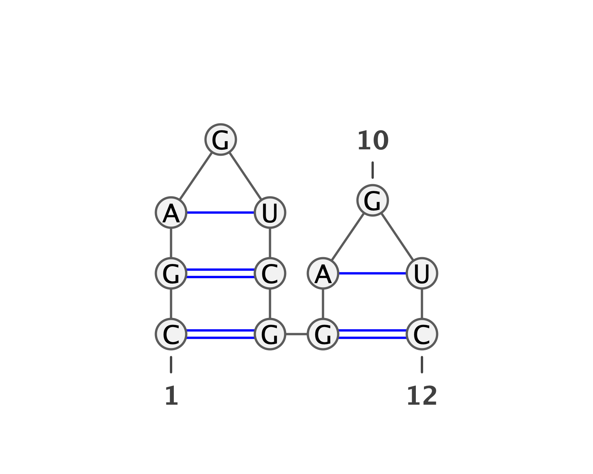
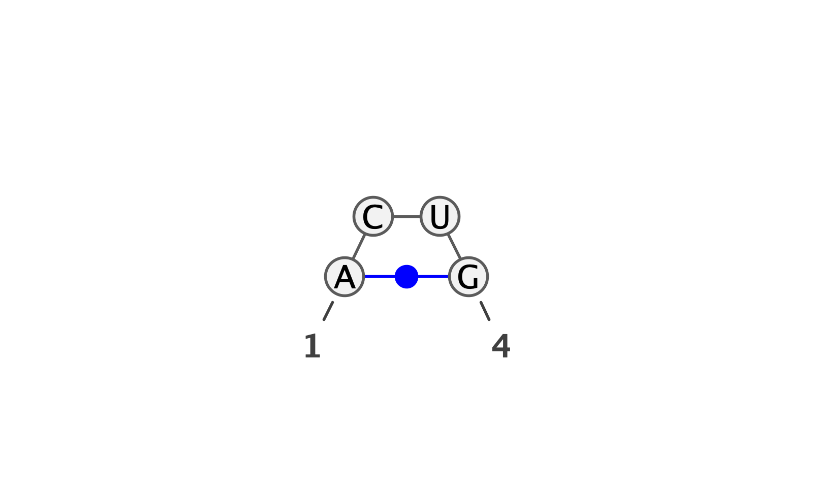

# CS571_final_project
This repository is for CS571 final project in Purdue University.


## Nussinov's Algorithm
In the directory of nussinov, it is a project of Nussinov's Algorithm.

If you want to run nussinov's Algorithm you can go to the nussinov directory and simply run:

```python
python main.py --seq [target sequence] --output [file location of output image] --min_loop_length [min loop length] --score_metrics_file [the file of score metrics]
```

For example, If you execute,

```python
python main.py --seq CGAGUCGGAGUC --output demo/demo1.png --min_loop_length 0
```

Note: If you don't specify the scoring metrics, we will use {(A, C): 1, (C, G): 1} as a default.

You will get the following output:



### Score Metrics Format
The Score metrics use the following format:

[First Nucleotide] [Second Nucleotide] [Weight]

You can see an example in `nussinov/score_metrics/score_1.txt`. In this example, we let (A, C) with the weight 1, (C, G) with the weight 1, and (A, G) with the weight 100.

```
A U 1
C G 1
A G 100
```

And we can use `score_metrics_file` option to change the score_metrics.

For example, we can use:

```
python main.py --seq ACUG --ouput demo/demo2.png --min_loop_length 0 --score_metrics_file score_metrics/score_1.txt
```

And you will get the following output:

